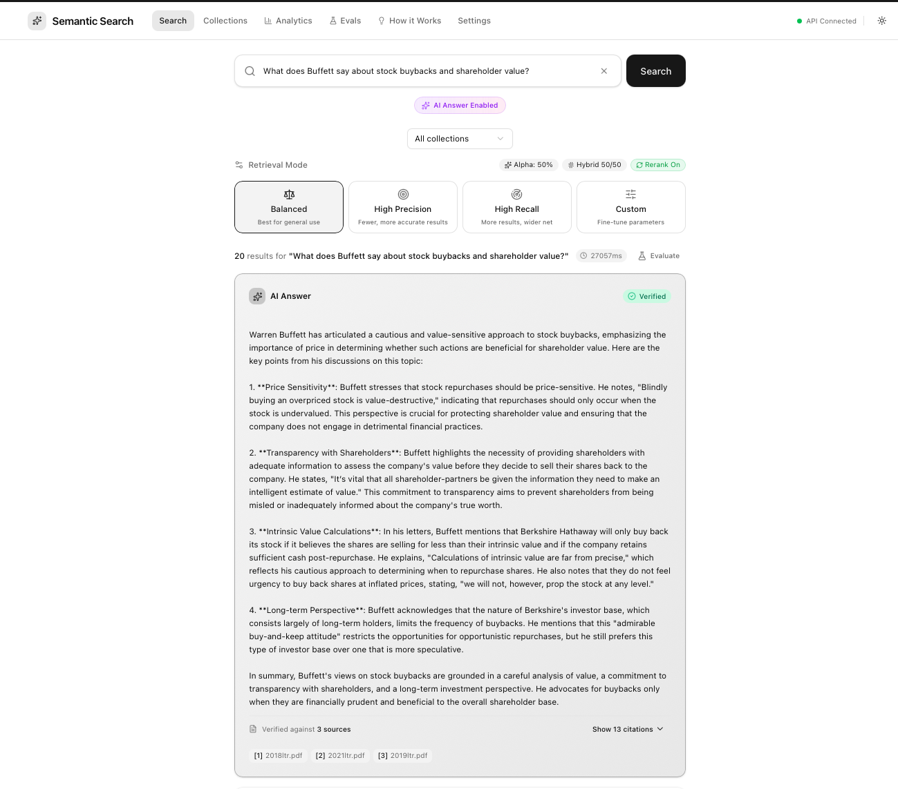
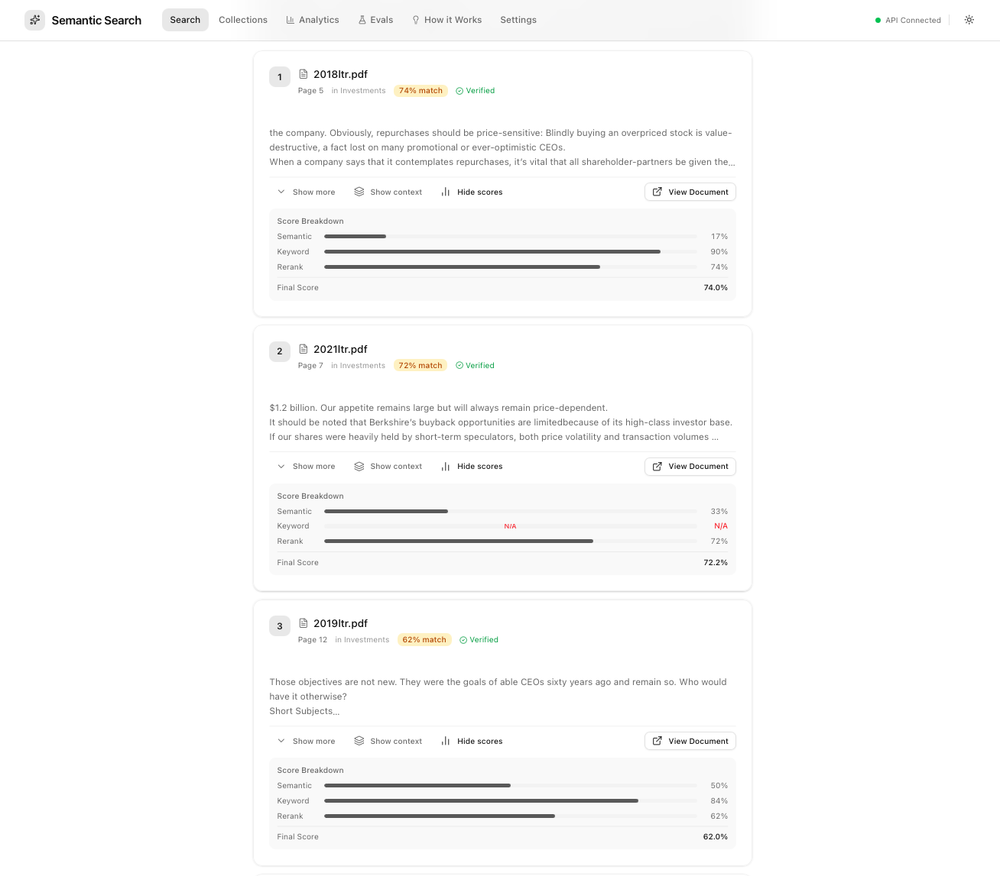
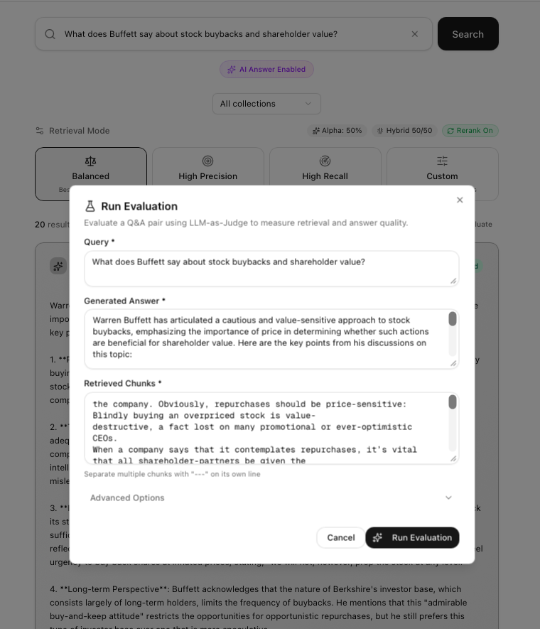
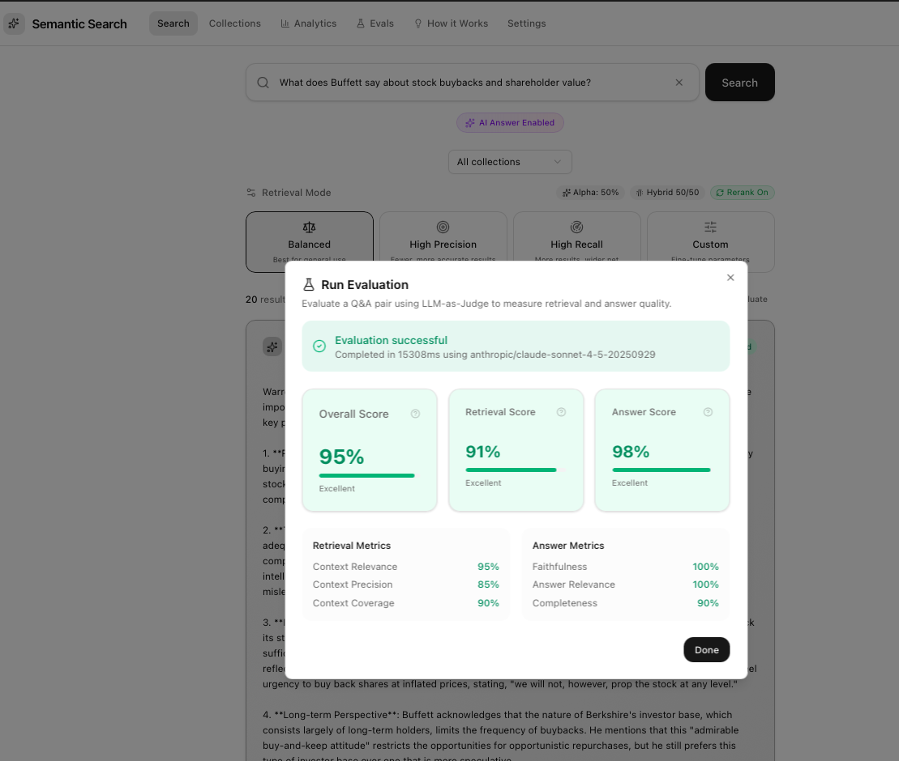

# Semantic Search Next

A full-stack RAG (Retrieval Augmented Generation) application with hybrid search, cross-encoder reranking, citation-verified AI answers, and LLM-as-Judge evaluation. Supports multiple AI providers including OpenAI, Anthropic, and Ollama for fully local operation.

## Pipeline Overview

When you search, here's what happens behind the scenes:

<table>
<tr>
<td align="center" width="14%">
<h3>📄</h3>
<b>1. Document</b><br/>
<sub>Upload & organize into collections</sub>
</td>
<td align="center" width="14%">
<h3>✂️</h3>
<b>2. Chunk</b><br/>
<sub>Split into searchable pieces</sub>
</td>
<td align="center" width="14%">
<h3>🧮</h3>
<b>3. Embed</b><br/>
<sub>Convert to vector embeddings</sub>
</td>
<td align="center" width="14%">
<h3>🔀</h3>
<b>4. Search</b><br/>
<sub>Hybrid BM25 + Semantic</sub>
</td>
<td align="center" width="14%">
<h3>🏆</h3>
<b>5. Rerank</b><br/>
<sub>Cross-encoder refinement</sub>
</td>
<td align="center" width="14%">
<h3>💬</h3>
<b>6. Answer</b><br/>
<sub>RAG-powered response</sub>
</td>
<td align="center" width="14%">
<h3>📊</h3>
<b>7. Eval</b><br/>
<sub>LLM-as-Judge quality</sub>
</td>
</tr>
</table>

### Pipeline Options

| Step | What It Does | Provider Options | Key Parameters |
|:-----|:-------------|:-----------------|:---------------|
| **Chunk** | Splits documents into searchable pieces | Built-in | `chunk_size` (default: 1000), `chunk_overlap` (200) |
| **Embed** | Converts text to vectors for semantic search | **Cloud:** OpenAI, Voyage, Cohere, Jina<br/>**Local:** Ollama | `embedding_model` |
| **Search** | Finds relevant chunks using hybrid retrieval | BM25 (keywords) + ChromaDB (semantic) | `alpha` (0=keywords, 1=semantic), `top_k`, `preset` |
| **Rerank** | AI scores each result for precise ranking | **Cloud:** Cohere<br/>**Local:** Jina | `reranker_provider` (auto/jina/cohere/none) |
| **Answer** | Generates response from retrieved context | **Cloud:** OpenAI, Anthropic<br/>**Local:** Ollama | `answer_provider`, `answer_model` |
| **Eval** | Measures retrieval & answer quality | **Cloud:** OpenAI, Anthropic<br/>**Local:** Ollama | `eval_judge_provider`, `eval_judge_model` |

> **All settings configurable via the Settings page (`/settings`)**. For fully local operation, use Ollama + Jina — no API keys required.

## How Search Works

```
┌─────────────────────────────────────────────────────────────────────────────────┐
│                              SEARCH FLOW                                        │
└─────────────────────────────────────────────────────────────────────────────────┘

  ┌─────────────┐
  │  Your Query │
  │ "How does   │
  │  auth work?"│
  └──────┬──────┘
         │
         ▼
  ┌─────────────┐     ┌────────────────────────────────────────────────────────┐
  │   EMBED     │     │  Convert query to 3072-dimensional vector using AI     │
  │   QUERY     │────▶│  (OpenAI text-embedding-3-large)                       │
  └──────┬──────┘     └────────────────────────────────────────────────────────┘
         │
         ▼
  ┌─────────────────────────────────────────┐
  │         PARALLEL RETRIEVAL              │
  │  ┌─────────────┐    ┌─────────────┐     │
  │  │  SEMANTIC   │    │    BM25     │     │
  │  │   SEARCH    │    │  KEYWORDS   │     │
  │  │ (ChromaDB)  │    │ (In-memory) │     │
  │  │             │    │             │     │
  │  │ Finds by    │    │ Finds by    │     │
  │  │  meaning    │    │ exact terms │     │
  │  └──────┬──────┘    └──────┬──────┘     │
  │         │                  │            │
  └─────────┼──────────────────┼────────────┘
            │                  │
            ▼                  ▼
  ┌─────────────────────────────────────────┐
  │    RECIPROCAL RANK FUSION (RRF)         │
  │                                         │
  │  Intelligently merge both result sets   │
  │  α=0.5 → 50% semantic + 50% keywords    │
  └──────────────────┬──────────────────────┘
                     │
                     ▼
  ┌─────────────────────────────────────────┐
  │    CROSS-ENCODER RERANKING              │
  │                                         │
  │  AI model scores each query-document    │
  │  pair for precise relevance (0-100%)    │
  └──────────────────┬──────────────────────┘
                     │
                     ▼
  ┌─────────────────────────────────────────┐
  │    CONFIDENCE FILTERING                 │
  │                                         │
  │  ┌─────────────┐    ┌─────────────┐     │
  │  │    HIGH     │    │     LOW     │     │
  │  │ CONFIDENCE  │    │ CONFIDENCE  │     │
  │  │  (≥30%)     │    │  (<30%)     │     │
  │  │  Shown      │    │  Hidden     │     │
  │  └─────────────┘    └─────────────┘     │
  └──────────────────┬──────────────────────┘
                     │
                     ▼
  ┌─────────────────────────────────────────┐
  │    OPTIONAL: AI ANSWER + CITATIONS      │
  │                                         │
  │  RAG-powered answer with verification   │
  │  Each claim linked to source document   │
  └─────────────────────────────────────────┘
```

> **Want to learn more?** The app includes an interactive **"How It Works"** page with detailed explanations of each concept, search quality progression, and settings guidance. See the [screenshots below](#how-it-works-page) or explore it yourself when running the app.

## Features

| Feature | Description |
|---------|-------------|
| **Hybrid Retrieval** | Combines BM25 keyword search with semantic embeddings using Reciprocal Rank Fusion (RRF) |
| **AI Answer Generation** | RAG-powered answers with citation verification and hallucination detection |
| **[RAG Evaluations](#rag-evaluations)** | LLM-as-Judge evaluation with retrieval & answer quality metrics |
| **AI Reranking** | Uses Jina cross-encoder (local) or Cohere API to rerank results for relevance |
| **Confidence Filtering** | Separates high-confidence from low-confidence results based on configurable threshold |
| **Answer Verification** | Extracts claims from AI answers and verifies them against source documents |
| **Search Analytics** | Dashboard with search history, latency trends, and usage statistics |
| **Document Preview** | View full document content with chunk navigation |
| **Collection Scoping** | Search across all documents or within specific collections |
| **Retrieval Presets** | High Precision / Balanced / High Recall modes |
| **Score Transparency** | View semantic, BM25, rerank, and final scores on results |
| **Multiple Providers** | Support for OpenAI, Anthropic, Ollama (local), Jina, Cohere, and Voyage AI |
| **Dark Mode** | Full theme support with system preference detection |

## Screenshots

### Semantic Search with AI Answer


### Detailed Relevance Scores


### LLM-as-Judge Evaluation
Run evaluations to measure search quality with configurable judge models.

| Run Evaluation | Evaluation Output |
|----------------|-------------------|
|  |  |

### More Screenshots

| Feature | Description |
|---------|-------------|
| [Evaluation Details](screenshots/5_Semantic-Search-Result-Eval-Details.png) | Detailed breakdown of evaluation metrics and scores |
| [Collections](screenshots/6_Semantic-Search-Collections.png) | Organize documents into searchable collections |
| [Documents](screenshots/7_Semantic-Search-Collections-Documents.png) | View and manage documents within collections |
| [Analytics](screenshots/8_Semantic-Search-Analytics.png) | Track search history, latency trends, and query patterns |
| [How It Works](screenshots/9_Semantic-Search-HowItWorks.png) | Interactive documentation explaining search technology |
| [Settings](screenshots/10_Semantic-Search-Settings.png) | Configure providers, models, and search parameters |

## Architecture

```
┌─────────────────────────────────────────────────────────────────┐
│                         FRONTEND                                │
│                    Next.js 15 (App Router)                      │
│              Shadcn/ui + Tailwind + TypeScript                  │
└─────────────────────────┬───────────────────────────────────────┘
                          │ HTTP/REST
                          ▼
┌─────────────────────────────────────────────────────────────────┐
│                         BACKEND                                 │
│                      FastAPI (Python)                           │
│  ┌─────────────┬─────────────┬─────────────┬─────────────────┐  │
│  │ Collections │  Documents  │   Search    │    Settings     │  │
│  │   API       │    API      │    API      │      API        │  │
│  └──────┬──────┴──────┬──────┴──────┬──────┴────────┬────────┘  │
│         │             │             │               │           │
│  ┌──────▼─────────────▼─────────────▼───────────────▼────────┐  │
│  │                    CORE SERVICES                          │  │
│  │  HybridSearchService │ Reranker │ VectorStore │ BM25Cache │  │
│  └──────┬───────────────┴──────────┴─────────────┬───────────┘  │
└─────────┼────────────────────────────────────────┼──────────────┘
          │                                        │
          ▼                                        ▼
┌─────────────────────┐                 ┌─────────────────────────┐
│     PostgreSQL      │                 │       ChromaDB          │
│  (Metadata + Config)│                 │    (Vector Store)       │
└─────────────────────┘                 └─────────────────────────┘
```

## Search Flow

1. **Query Embedding** - Generate embedding via OpenAI `text-embedding-3-large`
2. **Parallel Retrieval**:
   - Semantic search via ChromaDB (cosine similarity)
   - BM25 keyword search (in-memory, per-collection cache with auto-invalidation)
3. **Reciprocal Rank Fusion (RRF)** - Merge results with configurable alpha
4. **Reranking** - Jina cross-encoder (local) or Cohere API
5. **Confidence Filtering** - Split results by `min_score_threshold` (default: 35%)
6. **Response** - High-confidence results + hidden low-confidence results

## Tech Stack

### Backend
- **FastAPI** - Python web framework with async support
- **PostgreSQL** - Relational database (metadata, settings, search history)
- **ChromaDB** - Vector database for semantic search
- **OpenAI** - Embeddings (`text-embedding-3-large`)
- **Jina/Cohere** - Cross-encoder reranking
- **BM25** - Keyword search via `rank_bm25`

### Frontend
- **Next.js 15** - React framework with App Router
- **TypeScript** - Type safety
- **Tailwind CSS** - Utility-first styling
- **Shadcn/ui** - Component library
- **Lucide** - Icons

## Prerequisites

- Node.js 18+
- Python 3.11+
- Docker & Docker Compose

> **Detailed Setup Guide**: See [INFRASTRUCTURE.md](./docs/INFRASTRUCTURE.md) for comprehensive setup instructions including:
> - PostgreSQL & ChromaDB configuration
> - Local AI providers (Ollama, Jina reranker)
> - Cloud provider setup (OpenAI, Cohere, Voyage AI)
> - Troubleshooting guide
>
> **Quick Start**: See [SETUP.md](./docs/SETUP.md) for a concise, working local setup checklist.

## Local AI with Ollama (Optional)

Run the entire pipeline locally without API keys using Ollama:

### Install Ollama

```bash
# macOS
brew install ollama

# Linux
curl -fsSL https://ollama.com/install.sh | sh

# Windows - Download from https://ollama.com/download
```

### Pull Required Models

```bash
# Embedding model (choose one)
ollama pull nomic-embed-text-v2-moe  # Latest MoE, strong retrieval (recommended)
ollama pull nomic-embed-text      # Fast, good quality
ollama pull mxbai-embed-large     # Higher quality, slower

# LLM for answers & evaluation (choose one)
ollama pull llama3.2              # Fast, 3B params (recommended)
ollama pull llama3.1:8b           # Better quality, 8B params
ollama pull mistral               # Good balance
```

### Start Ollama Server

```bash
ollama serve  # Runs on http://localhost:11434
```

### Configure in App

1. Start the app and go to **Settings** (`/settings`)
2. Configure Ollama models:
   - **Embedding Model**: `ollama:nomic-embed-text-v2-moe:latest` (or `ollama:nomic-embed-text`)
   - **Answer Provider**: `ollama` → Model: `llama3.2`
   - **Eval Provider**: `ollama` → Model: `llama3.1:8b`

> **Note**: Ollama runs locally - no API keys required. First request may be slow as models load into memory.

## Quick Start

### 1. Clone and setup environment

```bash
git clone https://github.com/shrimpy8/semantic-search-next.git
cd semantic-search-next

# Copy environment files
cp backend/.env.example backend/.env
cp frontend/.env.example frontend/.env.local
# Edit with your API keys
```

### 2. Start Docker Services

```bash
# Start PostgreSQL + pgAdmin
docker-compose up -d

# Start ChromaDB (separate container)
docker run -d --name chromadb -p 8000:8000 chromadb/chroma
```

Services started:
- **PostgreSQL**: `localhost:5432`
- **ChromaDB**: `localhost:8000`
- **pgAdmin**: `http://localhost:3001` (login: `admin@local.dev` / `admin`)

### 3. Backend Setup

```bash
cd backend

# Create virtual environment
python -m venv .venv
source .venv/bin/activate  # macOS/Linux
# .venv\Scripts\activate   # Windows

# Install dependencies
pip install -e ".[dev]"

# Run FastAPI server
uvicorn app.main:app --reload --port 8080
```

- API: `http://localhost:8080`
- Swagger docs: `http://localhost:8080/docs`

### 4. Frontend Setup

```bash
cd frontend

# Install dependencies
npm install

# Run development server
npm run dev
```

Frontend: `http://localhost:3000`

## Environment Variables

Copy `.env.example` files in `backend/` and `frontend/` directories. See `.env.example` for comprehensive documentation.

### Backend (backend/.env)

```env
# Debug Mode
DEBUG=false                          # Set true for verbose logging

# OpenAI (required for default config)
OPENAI_API_KEY=sk-...
EMBEDDING_MODEL=text-embedding-3-large
LLM_MODEL=gpt-4o-mini

# Alternative Embedding Providers (optional)
OLLAMA_BASE_URL=http://localhost:11434  # Local, no API key needed
JINA_API_KEY=...                         # Free tier: 1M tokens/mo
COHERE_API_KEY=...                       # Also used for reranking
VOYAGE_API_KEY=...                       # RAG optimized

# Database
POSTGRES_HOST=localhost
POSTGRES_PORT=5432
POSTGRES_DB=semantic_search
POSTGRES_USER=postgres
POSTGRES_PASSWORD=postgres

# ChromaDB
CHROMA_HOST=localhost
CHROMA_PORT=8000

# Reranking
RERANKER_PROVIDER=auto               # auto | jina | cohere
USE_RERANKING=true
```

### Frontend (frontend/.env.local)

```env
NEXT_PUBLIC_API_URL=http://localhost:8080/api/v1
NEXT_PUBLIC_DEBUG=false              # Set true for console logging
```

## Project Structure

```
semantic-search-next/
├── docker-compose.yml           # PostgreSQL + ChromaDB + pgAdmin
├── docs/
│   ├── ARCHITECTURE.md          # Detailed system design
│   ├── INFRASTRUCTURE.md        # Setup guide for all services
│   ├── PROJECT_STATUS.md        # Implementation status & roadmap
│   └── SETUP.md                 # Quick-start setup checklist
├── backend/
│   ├── .env.example             # Backend environment template
│   ├── app/
│   │   ├── main.py              # FastAPI entry
│   │   ├── config.py            # Settings
│   │   ├── api/v1/              # REST endpoints
│   │   │   ├── collections.py   # Collection CRUD
│   │   │   ├── documents.py     # Document upload/delete
│   │   │   ├── search.py        # Search with AI answers
│   │   │   ├── analytics.py     # Search analytics
│   │   │   ├── settings.py      # App settings
│   │   │   └── health.py        # Health check
│   │   ├── core/                # Business logic
│   │   │   ├── hybrid_retriever.py  # RRF fusion
│   │   │   ├── reranker.py      # Jina/Cohere reranking
│   │   │   ├── qa_chain.py      # RAG answer generation
│   │   │   ├── answer_verifier.py   # Citation verification
│   │   │   └── embeddings.py    # Multi-provider embeddings
│   │   ├── prompts/             # Externalized LLM prompts
│   │   │   ├── qa.yaml          # QA generation prompts
│   │   │   └── verification.yaml    # Verification prompts
│   │   ├── services/
│   │   │   └── retrieval.py     # HybridSearchService + BM25 cache
│   │   ├── db/
│   │   │   └── models.py        # SQLAlchemy models
│   │   └── api/
│   │       └── schemas.py       # Pydantic schemas
│   └── pyproject.toml
├── frontend/
│   ├── .env.example             # Frontend environment template
│   ├── src/
│   │   ├── app/                 # Next.js App Router
│   │   │   ├── page.tsx         # Main search page
│   │   │   ├── analytics/       # Search analytics dashboard
│   │   │   ├── documents/[id]/  # Document preview
│   │   │   ├── collections/     # Collection management
│   │   │   └── settings/        # Settings page
│   │   ├── components/
│   │   │   ├── ui/              # Shadcn components
│   │   │   ├── layout/          # Header, sidebar
│   │   │   ├── search/          # Search components
│   │   │   ├── analytics/       # Analytics charts
│   │   │   └── documents/       # Document viewer
│   │   ├── lib/
│   │   │   ├── api/             # API client & types
│   │   │   └── debug.ts         # Debug logging utility
│   │   └── hooks/               # TanStack Query hooks
│   ├── package.json
│   └── tsconfig.json
└── README.md
```

## API Endpoints

### Collections
```
POST   /api/v1/collections              Create collection
GET    /api/v1/collections              List collections
GET    /api/v1/collections/{id}         Get collection
PATCH  /api/v1/collections/{id}         Update collection
DELETE /api/v1/collections/{id}         Delete collection
```

### Documents
```
POST   /api/v1/collections/{id}/documents   Upload document (invalidates BM25 cache)
GET    /api/v1/collections/{id}/documents   List documents
GET    /api/v1/documents/{id}               Get document
DELETE /api/v1/documents/{id}               Delete document (invalidates BM25 cache)
```

### Search
```
POST   /api/v1/search                   Execute search with optional AI answer
```

**Request:**
```json
{
  "query": "machine learning",
  "preset": "balanced",
  "top_k": 10,
  "collection_id": "optional-uuid",
  "generate_answer": true
}
```

**Response:**
```json
{
  "query": "machine learning",
  "results": [...],
  "low_confidence_results": [...],
  "low_confidence_count": 3,
  "min_score_threshold": 0.35,
  "answer": "Machine learning is...",
  "answer_verification": {
    "confidence": "high",
    "citations": [...],
    "verified_claims": 3,
    "total_claims": 3,
    "coverage_percent": 100
  },
  "latency_ms": 245,
  "retrieval_method": "balanced"
}
```

### Analytics
```
GET    /api/v1/analytics/searches       Search history (paginated)
GET    /api/v1/analytics/stats          Aggregate statistics
GET    /api/v1/analytics/trends         Time-series data
```

### Evaluations
```
POST   /api/v1/evals/evaluate           Run LLM-as-Judge evaluation
GET    /api/v1/evals/results            List evaluation results
GET    /api/v1/evals/results/{id}       Get single evaluation
GET    /api/v1/evals/stats              Aggregate evaluation stats
GET    /api/v1/evals/providers          List available judge providers
```

### Settings
```
GET    /api/v1/settings                 Get current settings
PATCH  /api/v1/settings                 Update settings
POST   /api/v1/settings/reset           Reset to defaults
```

**Key Settings:**
| Setting | Type | Default | Description |
|---------|------|---------|-------------|
| `default_preset` | string | `balanced` | Retrieval preset |
| `default_alpha` | float | 0.5 | Semantic vs BM25 weight |
| `default_use_reranker` | bool | true | Enable reranking |
| `default_top_k` | int | 10 | Results to return |
| `min_score_threshold` | float | 0.30 | Low-confidence cutoff |
| `default_generate_answer` | bool | false | Enable AI answer generation |
| `default_context_window` | int | 1 | Chunks before/after for context |
| `show_scores` | bool | true | Display score breakdown |

### Health
```
GET    /api/v1/health                   Health check
```

## Search Result Scores

Each result includes a `scores` object:

```json
{
  "scores": {
    "semantic_score": 0.85,    // Normalized 0-1 (cosine similarity)
    "bm25_score": 0.72,        // Normalized 0-1 (keyword match)
    "rerank_score": 0.92,      // Cross-encoder 0-1 (when enabled)
    "final_score": 0.92,       // Used for ranking/filtering
    "relevance_percent": 92    // Display value (0-100%)
  }
}
```

## Development

### Backend

```bash
cd backend
source .venv/bin/activate

# Lint
ruff check .

# Format
ruff format .

# Type check
mypy app

# Test
pytest
```

### Frontend

```bash
cd frontend

# Lint
npm run lint

# Format
npm run format

# Build
npm run build
```

## Test Queries

```bash
# High-confidence query
curl -s -X POST "http://localhost:8080/api/v1/search" \
  -H "Content-Type: application/json" \
  -d '{"query": "machine learning", "preset": "balanced", "top_k": 5}'

# Low-confidence query (unrelated to docs)
curl -s -X POST "http://localhost:8080/api/v1/search" \
  -H "Content-Type: application/json" \
  -d '{"query": "quantum entanglement physics", "preset": "balanced", "top_k": 10}'

# Check settings
curl -s http://localhost:8080/api/v1/settings

# Health check
curl -s http://localhost:8080/api/v1/health
```

## Retrieval Presets

| Preset | Alpha | Use Reranker | Description |
|--------|-------|--------------|-------------|
| `high_precision` | 0.8 | true | Emphasizes semantic similarity, best for specific queries |
| `balanced` | 0.5 | true | Equal weight to semantic and keyword, good default |
| `high_recall` | 0.3 | true | Emphasizes keyword matching, better for exploratory search |

## Known Considerations

- **BM25 Cache**: Automatically invalidated when documents are uploaded/deleted
- **Confidence Threshold**: Adjustable via Settings API (`min_score_threshold`)
- **Reranking**: Falls back to Jina local model if Cohere unavailable

## RAG Evaluations

Measure and improve your search quality with LLM-as-Judge evaluation. The system evaluates both retrieval quality (finding the right chunks) and answer quality (generating accurate responses).

### Evaluation Metrics

| Category | Metric | Description |
|----------|--------|-------------|
| **Retrieval** | Context Relevance | How relevant are the retrieved chunks? |
| **Retrieval** | Context Precision | Are irrelevant chunks filtered out? |
| **Retrieval** | Context Coverage | Is all needed information present? |
| **Answer** | Faithfulness | Is the answer grounded in the chunks? |
| **Answer** | Answer Relevance | Does it answer the question? |
| **Answer** | Completeness | Is anything missing? |

### Score Interpretation

| Score Range | Quality | Action |
|-------------|---------|--------|
| > 0.8 | Excellent | System working well |
| 0.6 - 0.8 | Good | Minor improvements possible |
| 0.4 - 0.6 | Moderate | Review retrieval/generation settings |
| < 0.4 | Poor | Significant tuning needed |

### Judge Providers

Configure the evaluation LLM in Settings (`/settings`):

- **OpenAI** - GPT-4o-mini (fast), GPT-4o (best quality)
- **Anthropic** - Claude Sonnet 4, Claude Opus 4
- **Ollama** - Llama 3.2, Llama 3.1 (local, free)

### Learn More

Visit `/learn-evals` in the app for an interactive guide explaining evaluation concepts, when to use them, and how to act on results.

## License

MIT License
